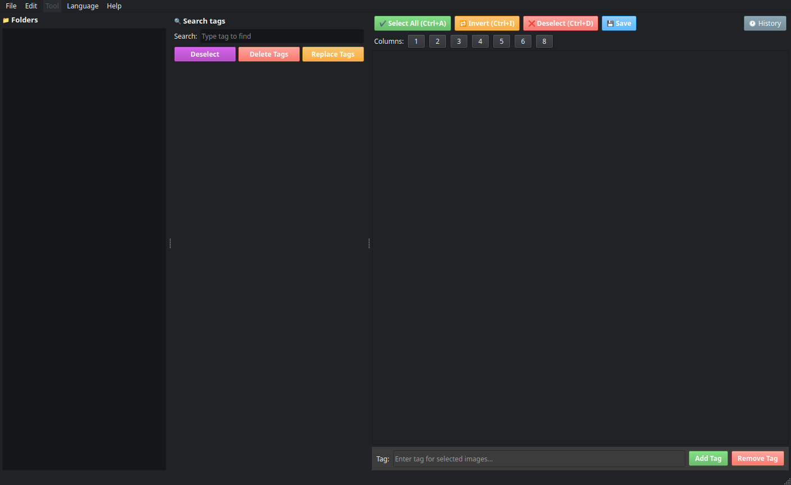

# TKtagger

A powerful image tagging tool built with PySide6, supporting WD14 Tagger and bulk tag management.

> **Note:** This project uses AI assistance for coding.

---

## Interface



---

## Features

- **Bulk tag editing** — Add, remove, replace, or sort tags across multiple images at once
- **WD14 Tagger** — Automatic tagging via local model or external API
- **Undo / Redo** — Up to 100 steps with a full operation history window (`Edit → Operation history` or `🕐 History`)
- **Tag search** — Filter and find tags across your image set quickly with JEI-style multi-token search
- **Quick tag interaction** — Click directly on a tag to delete or insert
- **Optimized image loading** — Reduced memory usage and faster display
- **Multi-language support** — Interface available in multiple languages (i18n)
- **Command-line argument** — Launch directly into a folder: `python main.py [path_folder]`
- **Dictionary system** — Organize tags into named groups with virtual tag expansion
- **Resort by groups** — Reorder tags in `.txt` files according to dictionary group order, with `BREAK` separator support for Kohya training

---

## Installation

```bash
python3 -m venv venv
source venv/bin/activate
pip install -r requirements.txt
```

## Running

```bash
python3 main.py

# Open directly into a specific folder
python3 main.py /path/to/folder
```

---

## Keyboard Shortcuts

| Shortcut | Action |
|----------|--------|
| `Ctrl+A` | Select all images |
| `Ctrl+I` | Invert selection |
| `Ctrl+D` | Deselect all |
| `Ctrl+Z` | Undo |
| `Ctrl+Y` | Redo |
| `Ctrl+E` / `F5` | Remove duplicate tags |
| `Ctrl+R` / `F6` | Sort tags |
| `Ctrl+Shift+R` / `F7` | Resort tags by groups |
| `Ctrl+T` / `F8` | Open WD14 Tagger |
| `Ctrl+Shift+D` / `F9` | Open Dataset Calculator |

---

## Project Structure

```
tktagger/
├── main.py                   # Entry point
├── main_window.py            # Main window
├── image_grid.py             # Image grid widget (ImageGrid, ImageCard)
├── tag_panel.py              # Tag panel with group filter
├── history_manager.py        # Undo/Redo manager (HistoryManager)
├── history_window.py         # Operation history window
├── file_ops.py               # Read/write files (load/save tags)
├── dialogs.py                # Dialogs (Sort, Replace, About)
├── dict_tags.py              # Dictionary manager + VirtualTagEngine
├── resort_tags_by_groups.py  # Resort tags by group order
├── sort_tags.py              # Sort tags logic
├── remove_duplicate_tags.py  # Remove duplicate tags logic
├── settings_manager.py       # Global settings singleton
├── tagger_logic.py           # WD14 tagger backend (ONNX / API)
├── waifu_tagger_window.py    # WD14 tagger UI
├── calc_dataset.py           # Dataset repeat calculator
├── i18n.py                   # Internationalization
├── i18n.json                 # Translation strings (EN, VI)
├── defualt_dictbook.json     # Sample dictionary file
└── README.md
```

---

## Changelog

### Unreleased — since v1.3.0

#### Added

- **Dictionary system** (`dict_tags.py`) — Create and manage tag dictionaries organized into named groups. Each group can have an emoji label and be marked as hidden (used as a parameter source only). Accessible via the new `Dict` menu: New / Load / Save / Reload / Open Manager.

- **Virtual tag expansion** (`VirtualTagEngine`) — Tags in a dictionary group can use `${GroupName}_base_word` syntax to auto-generate all combinations. For example, if a `Color` group contains `red` and `blue`, the tag `${Color}_hair` expands to `red_hair` and `blue_hair`. Legacy `[GroupName]` syntax is also supported.

- **Resort Tags by Groups** (`resort_tags_by_groups.py`) — Reorder tags inside `.txt` caption files according to the dictionary group order. Supports drag-and-drop reordering of groups, `BREAK` separators (outputs as a line break in `.txt` files, compatible with Kohya's tag attention syntax), random preview from a file in the current folder, and a Global mode to process all subfolders recursively.

- **Tag Panel group filter** — When a dictionary is loaded, a group dropdown appears in the tag panel to filter the displayed tag list by group. Hidden when no dictionary is loaded.

- **JEI-style tag search** — Tag search now supports comma-separated tokens with OR logic. Typing `hair, eye` shows all tags containing either "hair" or "eye".

- **F-key shortcuts** — All tool actions now have dual shortcuts: `F5` through `F9` as alternatives to the existing `Ctrl` shortcuts.

- **Sample dictionary file** (`defualt_dictbook.json`) — A starter bookdict with Character and Color groups included.

- **Settings manager** (`settings_manager.py`) — Singleton `SettingsManager` wrapping `QSettings` with proper app/org naming, signals for bookdict changes (`bookdict_changed`, `bookdict_order_changed`), and recent files management. Infrastructure for future settings migration.

#### Changed

- **Sort tags** logic extracted from `main_window.py` into `sort_tags.py` — same behavior, easier to test and reuse independently.

- **Remove duplicate tags** logic extracted from `main_window.py` into `remove_duplicate_tags.py` — same behavior, easier to test and reuse independently.

- **Window default size** set to `1024×720`.

- **Resort window syncs** with folder navigation — if the Resort Tags window is open when you switch folders in the tree, it updates automatically without needing to reopen.

---

## Roadmap

1. ✅ Basic tagger UI
2. ✅ Integrated WD14
3. ✅ Multiple language support
4. ✅ System dictionary tags
5. ⬜ Redesigned UI