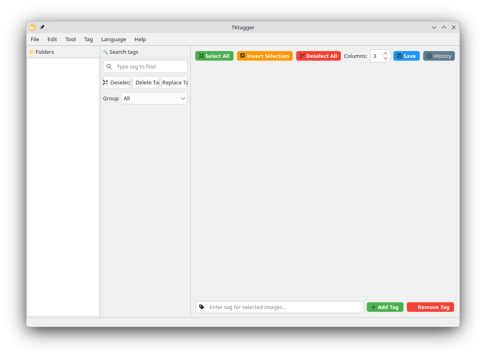

# TKtagger

A powerful image tagging tool built with PySide6, supporting WD14 Tagger and bulk tag management for AI training datasets.

> **Note:** This project uses AI assistance for coding.

---

English (README.md) · [Tiếng Việt](src/README_VN.md)

---

## Interface



---

## Features

- **Bulk tag editing** — Add, remove, replace, or sort tags across multiple images at once
- **WD14 Tagger** — Automatic tagging via local ONNX model or external API
- **Undo / Redo** — Up to 256 steps with a full operation history panel (`Edit → Operation history` or `🕐 History`)
- **Tag search** — Filter and find tags across your dataset with JEI-style multi-token search
- **Quick tag interaction** — Click directly on a tag to delete or insert it
- **Optimized image loading** — Reduced memory usage and faster display
- **Multi-language support** — Interface available in multiple languages (i18n)
- **Command-line argument** — Launch directly into a folder: `python main.py [path_folder]`
- **Dictionary system** — Organize tags into named groups with virtual tag expansion
- **Resort by groups** — Reorder tags in `.txt` files according to dictionary group order, with `NewLine` separator support for visual clarity in external editors

---

## Installation

```bash
python3 -m venv venv
source venv/bin/activate
pip install -r requirements.txt
```

## Running

```bash
python3 main.py

# Open directly into a specific folder
python3 main.py /path/to/folder
```

---

## Keyboard Shortcuts

| Shortcut | Action |
|----------|--------|
| `Ctrl+A` | Select all images |
| `Ctrl+I` | Invert selection |
| `Ctrl+D` | Deselect all |
| `Ctrl+Z` | Undo |
| `Ctrl+Y` | Redo |
| `Ctrl+E` / `F5` | Remove duplicate tags |
| `Ctrl+R` / `F6` | Sort tags operations |
| `Ctrl+T` / `F8` | Open WD14 Tagger |
| `Ctrl+Shift+D` / `F9` | Open Dataset Calculator |

---

## Project Structure

```
TKtagger/
│
├── main.py                              # Entry point
├── main_window.py                       # MainWindow (QMainWindow) — core UI
├── settings_manager.py                  # Singleton settings via ConfigParser (settings.ini)
├── settings.ini                         # User settings file (auto-generated)
│
├── tag_panel.py                         # Right panel: tag list per folder
├── image_grid.py                        # Image grid display, selection management
├── file_ops.py                          # Load/save images & tags, build folder tree
├── history_manager.py                   # Undo/Redo stack manager
├── history_window.py                    # Action History UI panel
├── dialogs.py                           # AboutDialog and misc dialogs
├── i18n.py                              # Internationalization (tr(), set_language())
│
├── defualt_dictbook.json                # Sample dictionary bundled with app
├── requirements.txt                     # Python dependencies
│
├── lang/                                # Language files
│   ├── en.json                          # English
│   └── vi.json                          # Vietnamese
│
├── libs/                                # Reusable UI components
│   └── draggable_list.py                # Draggable list widget with per-item delete
│
├── tools/                               # Dataset processing tools
│   ├── waifu_tagger_window.py           # WD14 Tagger — auto-tag via ONNX / API
│   ├── tagger_logic.py                  # Inference logic (local + API mode)
│   ├── calculator_dataset.py            # Dataset Calculator dialog
│   ├── dict_tags.py                     # Dict Tags manager + VirtualTagEngine
│   ├── remove_duplicate_tags.py         # Remove duplicate tags from .txt files
│   ├── replace_tags.py                  # Replace tags dialog (bulk edit)
│   └── resort_tag_window_operation.py   # Resort + Sort tags (merged from 2 files)
│
└── src/                                 # Assets
    ├── Qt_logo_2016.svg
    └── Screenshot_*.png                 # Preview images for README
```

---

## Changelog — v1.4.1

### ✨ Added

**Auto-load Dict**
Set a fixed dictionary path via the Dict menu. The app will automatically load it on startup via `settings.ini` — no need to select it manually every session.

**Extended Edit Menu**
Added standard shortcuts (`Ctrl+A`, `Ctrl+D`, `Ctrl+I`) and a new **Nuke Selection** action to wipe all tags from selected images in one click.

### 🛠 Changes

**Project Reorganize**
All loose scripts moved into `/tools`. Similar sorting logic merged into a single file for easier maintenance.

**Folder Session Workflow**
New session cache model: switch between multiple folders freely without losing state. `Ctrl+S` now writes all changes from every folder opened in the current session at once — no repeated save prompts.

**INI Settings**
Migrated from QSettings (OS registry/plist) to a plain `settings.ini` file next to the app. Easier to back up and portable when moving the app folder.

**WD14 Tagger Redesign**
Window resized and wrapped in a `QScrollArea`. All buttons now follow app-wide style constants (`_BTN_PRIMARY` green, `_BTN_BROWSE` dark) — consistent with the rest of the UI.

**Core Refactor**
Removed redundant `self.lang` variable. Resort Tags logic extracted out of `main_window.py`. i18n keys standardized to `ldl_` prefix.

### 🐛 Fixed

**History order reversed**
Action History panel was displaying entries bottom-up. Fixed — newest action now always appears at the correct position.

**WD14 Tagger had no History snapshot**
Auto-tag operations could not be undone. Fixed — WD14 now correctly pushes snapshots to the history manager.

**Hidden Groups still visible**
Groups marked `"Hidden": true` in the dictionary were still rendered in TagPanel and ResortTag. Fixed.

> Changelog summary written with AI assistance.

---

## Roadmap

- ✅ Basic tagger UI
- ✅ Integrated WD14
- ✅ Multiple language support
- ✅ System dictionary tags
- ✅ Redesigned UI

The core roadmap is complete. Future updates will focus on maintenance and bug fixes rather than major new features.
