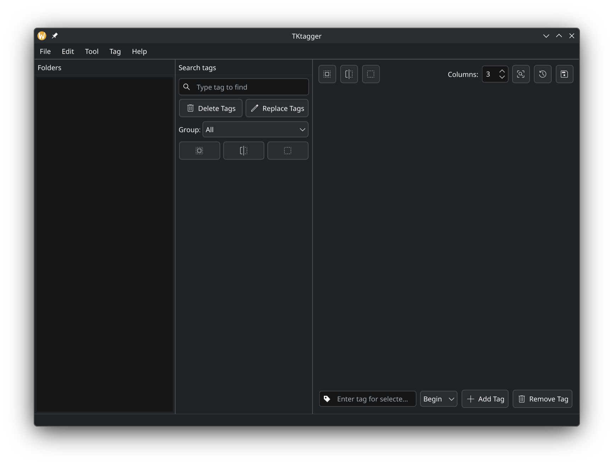

# TKtagger

A powerful image tagging tool built with PySide6, supporting WD14 Tagger and bulk tag management.

> **Note:** This project uses AI assistance for coding.

---

## Interface



English (README.md), Tiếng Việt (src/README_VN.md)

---

## Features

- **Bulk tag editing** — Add, remove, replace, or sort tags across multiple images at once
- **WD14 Tagger** — Automatic tagging via local model or external API
- **Undo / Redo** — Up to 256 steps with a full operation history window (`Edit → Operation history` or `🕐 History`)
- **Tag search** — Filter and find tags across your image set quickly with JEI-style multi-token search
- **Quick tag interaction** — Click directly on a tag to delete or insert
- **Optimized image loading** — Reduced memory usage and faster display
- **Multi-language support** — Interface available in multiple languages (i18n)
- **Command-line argument** — Launch directly into a folder: `python main.py [path_folder]`
- **Dictionary system** — Organize tags into named groups with virtual tag expansion
- **Resort by groups** — Reorder tags in `.txt` files according to dictionary group order, with ~~`BREAK`~~ `NewLine` ~~separator support for Kohya training~~ for visual look extenal editor

---

## Installation

```bash
python3 -m venv venv
source venv/bin/activate
pip install -r requirements.txt
```

## Running

```bash
python3 main.py

# Open directly into a specific folder
python3 main.py /path/to/folder_app
```

---

## Keyboard Shortcuts

| Shortcut | Action |
|----------|--------|
| `Ctrl+A` | Select all images |
| `Ctrl+I` | Invert selection |
| `Ctrl+D` | Deselect all |
| `Ctrl+Z` | Undo |
| `Ctrl+Y` | Redo |
| `Ctrl+E` / `F5` | Remove duplicate tags |
| `Ctrl+R` / `F6` | Sort tags operations|
| `Ctrl+T` / `F8` | Open WD14 Tagger |
| `Ctrl+Shift+D` / `F9` | Open Dataset Calculator |

---

## Project Structure
```
TKtagger/
│
├── main.py                         # Entry point
├── main_window.py                  # MainWindow (QMainWindow) — core UI
├── settings_manager.py             # Singleton settings via ConfigParser (settings.ini)
├── settings.ini                    # User settings file (auto-generated)
│
├── tag_panel.py                    # Right-side panel: tag list organized by folder
├── image_grid.py                   # Image display grid and selection management
├── file_ops.py                     # Load/save images & tags, build folder tree
├── history_manager.py              # Undo/Redo stack manager
├── history_window.py               # UI panel displaying Action History
├── dialogs.py                      # AboutDialog and other small dialogs
├── i18n.py                         # Internationalization (tr(), set_language())
│
├── default_dictbook.json           # Default dictionary included with the app
├── requirements.txt                # Dependencies
│
├── lang/                           # Language files
│   ├── en.json                     # English
│   └── vi.json                     # Vietnamese
│
├── libs/                           # Reusable UI components
│   └── draggable_list.py           # Draggable list widget with per-item deletion
│
├── tools/                          # Dataset processing tools
│   ├── waifu_tagger_window.py      # WD14 Tagger — auto-tag images via ONNX / API
│   ├── tagger_logic.py             # Inference logic (local + API modes)
│   ├── calculator_dataset.py       # Dataset Calculator dialog
│   ├── dict_tags.py                # Dict Tags manager + VirtualTagEngine
│   ├── remove_duplicate_tags.py    # Remove duplicate tags in .txt files
│   ├── replace_tags.py             # Replace tags dialog (bulk edit)
│   └── resort_tag_window_operation.py  # Resort + Sort tags (merge from 2 old files)
│
└── src/                            # Assets
├── Qt_logo_2016.svg
└── Screenshot_*.png            # Preview images for README
```

---

## Changelog (overview) 1.4.1

### ✨ Added: Additional Features
Auto-load Dict: Set a fixed path for the dictionary file in the Dict menu. The app now automatically loads it upon startup via `settings.ini`, eliminating the need to select it manually every time the program opens.

Expanded Edit Menu: Added standard shortcuts (Ctrl+A, D, I) and a "Nuke Selection" feature (wiping all tags from the currently selected image) for quick data cleanup.

### 🛠 Changes: UX Structure
Project Reorganization: Restructured the entire codebase. Individual scripts were moved to the `/tools` folder, and similar sorting logic was consolidated into a single file for easier management.

Folder Workflow: Changed the session storage mechanism. You can now switch between multiple folders without losing state (no constant prompts to save); the Ctrl+S command now writes all changes from every open folder in the session back to the respective folders.

INI Settings: Switched from QSettings (Registry) to a `settings.ini` file located alongside the app. This facilitates backups and moving the app folder without losing configuration settings.

WD14 Tagger Standardization: Redesigned the tagger window (added scrollbar, adjusted size). Applied a standardized color-coding system to all buttons (`_BTN_PRIMARY`, `_BTN_BROWSE`).

Core Refactoring: Removed the redundant `self.lang` variable and moved "Resort Tags" logic out of the main file for cleaner code. Standardized i18n prefixes to `ldl_`.

### 🐛 Fixed: Bug Fixes

History: Reversed the display order so the most recent action always appears in the correct position. Most importantly: History support added for WD14 Tagger; the issue preventing Undo operations after auto-tagging has been resolved.

UI Filter: Fixed a bug where "Hidden Groups" remained visible in the TagPanel and ResortTag view even after being marked as hidden.

**Note:** Please note that this information was summarized and written by AI. ## Roadmap

1. ✅ Basic tagger UI
2. ✅ Integrated WD14
3. ✅ Multi-language support
4. ✅ System dictionary tags
5. ✅ Redesigned UI

Once the roadmap is complete, subsequent updates will mostly be minor, focusing on maintenance and bug fixes.