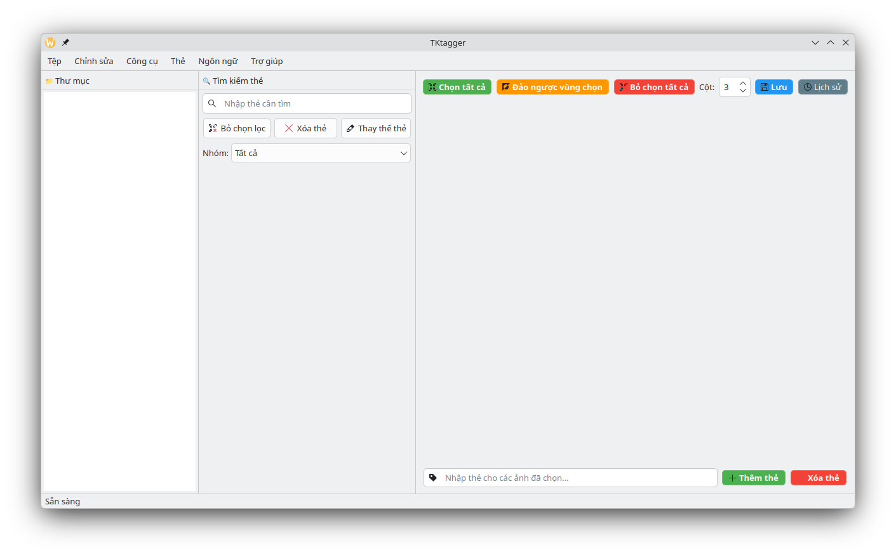

# TKtagger

Công cụ gắn thẻ ảnh mạnh mẽ xây dựng trên PySide6, hỗ trợ WD14 Tagger và chỉnh sửa thẻ hàng loạt cho dataset huấn luyện AI.

> **Ghi chú:** Dự án này sử dụng AI hỗ trợ lập trình.

---

[English](../README.md) · Tiếng Việt (README_VN.md)

---

## Giao diện



---

## Tính năng

- **Chỉnh sửa thẻ hàng loạt** — Thêm, xóa, thay thế hoặc sắp xếp thẻ trên nhiều ảnh cùng lúc
- **WD14 Tagger** — Tự động gắn thẻ qua model ONNX cục bộ hoặc API ngoài
- **Hoàn tác / Làm lại** — Lên đến 256 bước với bảng lịch sử thao tác đầy đủ (`Chỉnh sửa → Lịch sử thao tác` hoặc `🕐 Lịch sử`)
- **Tìm kiếm thẻ** — Lọc và tìm thẻ nhanh theo kiểu JEI multi-token search
- **Tương tác thẻ nhanh** — Click trực tiếp vào thẻ để xóa hoặc chèn
- **Tải ảnh tối ưu** — Giảm bộ nhớ sử dụng, hiển thị nhanh hơn
- **Đa ngôn ngữ** — Giao diện hỗ trợ nhiều ngôn ngữ (i18n)
- **Tham số dòng lệnh** — Mở thẳng vào thư mục: `python main.py [đường_dẫn]`
- **Hệ thống từ điển thẻ** — Tổ chức thẻ thành nhóm với virtual tag expansion
- **Sắp xếp theo nhóm** — Tái sắp xếp thẻ trong file `.txt` theo thứ tự nhóm từ điển, hỗ trợ dấu phân cách `NewLine` để dễ đọc trên editor ngoài

---

## Cài đặt

```bash
python3 -m venv venv
source venv/bin/activate
pip install -r requirements.txt
```

## Chạy chương trình

```bash
python3 main.py

# Mở thẳng vào thư mục cụ thể
python3 main.py /đường/dẫn/thư/mục
```

---

## Phím tắt

| Phím tắt | Chức năng |
|----------|-----------|
| `Ctrl+A` | Chọn tất cả ảnh |
| `Ctrl+I` | Đảo ngược vùng chọn |
| `Ctrl+D` | Bỏ chọn tất cả |
| `Ctrl+Z` | Hoàn tác |
| `Ctrl+Y` | Làm lại |
| `Ctrl+E` / `F5` | Xóa thẻ trùng |
| `Ctrl+R` / `F6` | Sắp xếp thẻ |
| `Ctrl+T` / `F8` | Mở WD14 Tagger |
| `Ctrl+Shift+D` / `F9` | Mở Dataset Calculator |

---

## Cấu trúc dự án

```
TKtagger/
│
├── main.py                              # Điểm khởi chạy
├── main_window.py                       # MainWindow (QMainWindow) — UI chính
├── settings_manager.py                  # Quản lý cài đặt toàn cục qua ConfigParser (settings.ini)
├── settings.ini                         # File cấu hình người dùng (tự tạo khi chạy)
│
├── tag_panel.py                         # Panel bên phải: danh sách thẻ theo thư mục
├── image_grid.py                        # Grid hiển thị ảnh, quản lý vùng chọn
├── file_ops.py                          # Load/save ảnh & thẻ, build cây thư mục
├── history_manager.py                   # Quản lý stack Hoàn tác/Làm lại
├── history_window.py                    # Panel UI hiển thị Lịch sử thao tác
├── dialogs.py                           # AboutDialog và các dialog phụ
├── i18n.py                              # Đa ngôn ngữ (tr(), set_language())
│
├── defualt_dictbook.json                # Từ điển mẫu đi kèm ứng dụng
├── requirements.txt                     # Thư viện Python cần thiết
│
├── lang/                                # File ngôn ngữ
│   ├── en.json                          # Tiếng Anh
│   └── vi.json                          # Tiếng Việt
│
├── libs/                                # UI component tái sử dụng
│   └── draggable_list.py                # Widget list kéo thả với nút xóa từng item
│
├── tools/                               # Công cụ xử lý dataset
│   ├── waifu_tagger_window.py           # WD14 Tagger — tự động gắn thẻ qua ONNX / API
│   ├── tagger_logic.py                  # Logic inference (chế độ local + API)
│   ├── calculator_dataset.py            # Dialog Dataset Calculator
│   ├── dict_tags.py                     # Quản lý từ điển thẻ + VirtualTagEngine
│   ├── remove_duplicate_tags.py         # Xóa thẻ trùng trong file .txt
│   ├── replace_tags.py                  # Dialog thay thế thẻ (chỉnh sửa hàng loạt)
│   └── resort_tag_window_operation.py   # Resort + Sort thẻ (gộp từ 2 file cũ)
│
└── src/                                 # Tài nguyên
    ├── Qt_logo_2016.svg
    └── Screenshot_*.png                 # Ảnh preview cho README
```

---

## Nhật ký thay đổi — v1.4.1

### ✨ Tính năng mới

**Tự động load từ điển**
Thiết lập đường dẫn từ điển cố định tại menu Dict. App sẽ tự động load ngay khi khởi động thông qua `settings.ini` — không cần chọn thủ công mỗi lần mở lại.

**Mở rộng menu Chỉnh sửa**
Bổ sung các phím tắt tiêu chuẩn (`Ctrl+A`, `Ctrl+D`, `Ctrl+I`) và tính năng **Nuke Selection** — xóa sạch toàn bộ thẻ của các ảnh đang chọn chỉ bằng một click.

### 🛠 Thay đổi

**Tái tổ chức dự án**
Toàn bộ script rời được đưa vào thư mục `/tools`. Các logic sắp xếp tương đồng được gộp vào một file duy nhất để dễ bảo trì.

**Quy trình làm việc theo session**
Cơ chế cache session mới: chuyển qua lại giữa nhiều folder thoải mái mà không mất state, không bị hỏi lưu liên tục. `Ctrl+S` ghi toàn bộ thay đổi của tất cả folder đã mở trong session ra disk chỉ một lần.

**Cài đặt dạng INI**
Chuyển từ QSettings (lưu vào Registry/plist của hệ điều hành) sang file `settings.ini` nằm ngay cạnh app. Dễ backup và di chuyển khi copy thư mục app sang máy khác.

**Thiết kế lại WD14 Tagger**
Cửa sổ được thu nhỏ lại và bọc trong `QScrollArea`. Toàn bộ nút bấm áp dụng bộ style chuẩn chung của app (`_BTN_PRIMARY` xanh lá, `_BTN_BROWSE` tối) — đồng bộ tông màu với phần còn lại.

**Refactor lõi**
Xóa biến `self.lang` thừa. Logic Resort Tags được tách ra khỏi `main_window.py`. Chuẩn hóa tiền tố i18n key sang `ldl_`.

### 🐛 Sửa lỗi

**Lịch sử hiển thị ngược thứ tự**
Panel Lịch sử thao tác hiển thị entry từ dưới lên. Đã sửa — hành động mới nhất luôn nằm đúng vị trí.

**WD14 Tagger không có snapshot lịch sử**
Thao tác auto-tag không thể hoàn tác. Đã sửa — WD14 giờ push snapshot đúng cách vào history manager.

**Hidden Group vẫn hiển thị**
Nhóm được đánh dấu `"Hidden": true` trong từ điển vẫn bị render trên TagPanel và ResortTag. Đã sửa.

> Nội dung changelog được tổng hợp với sự hỗ trợ của AI.

---

## Lộ trình phát triển

- ✅ Giao diện tagger cơ bản
- ✅ Tích hợp WD14
- ✅ Hỗ trợ đa ngôn ngữ
- ✅ Hệ thống từ điển thẻ
- ✅ Thiết kế lại UI

Lộ trình cốt lõi đã hoàn thành. Các bản cập nhật tiếp theo sẽ tập trung vào bảo trì và sửa lỗi thay vì thêm tính năng lớn.
